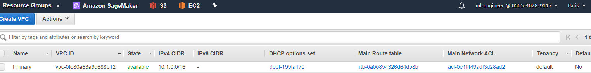
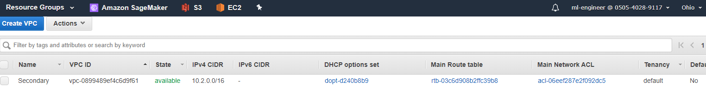
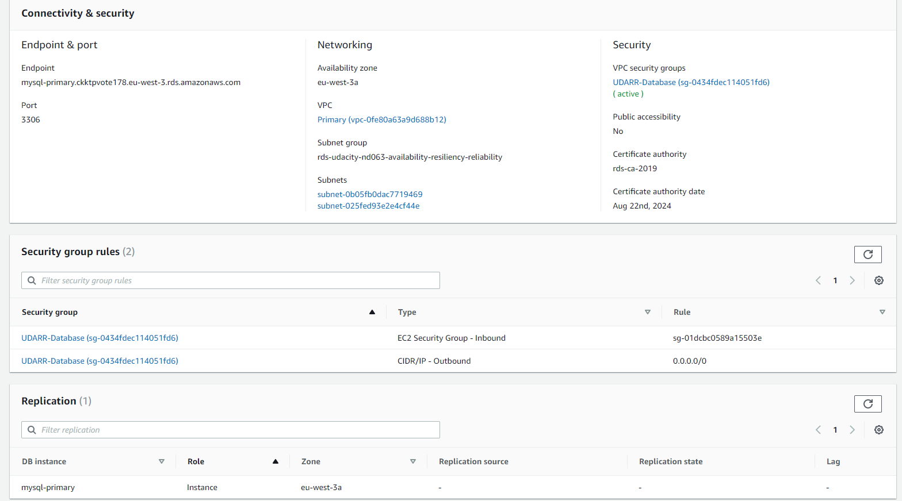
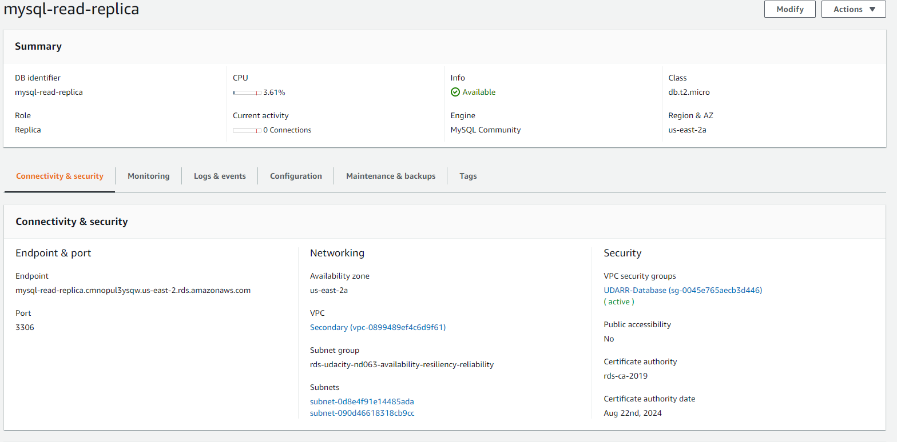
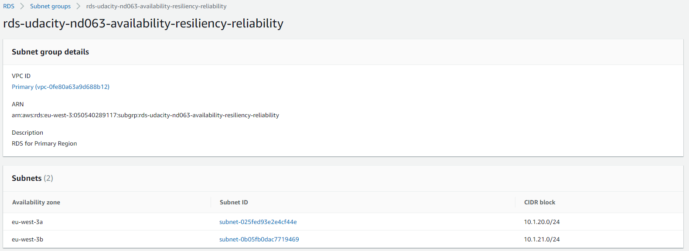
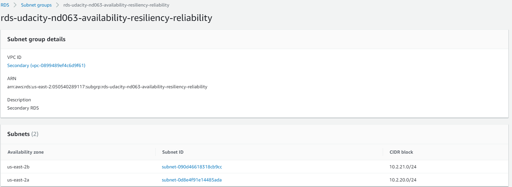
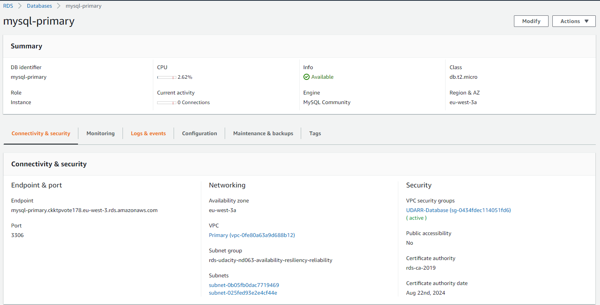
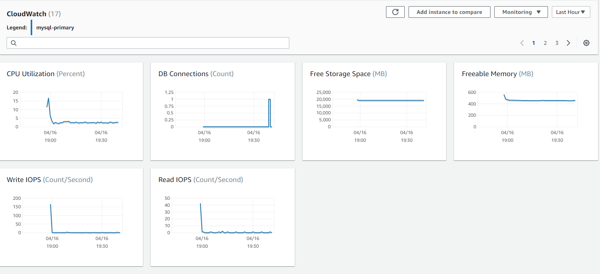
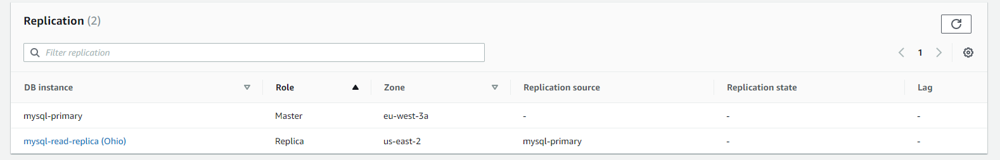
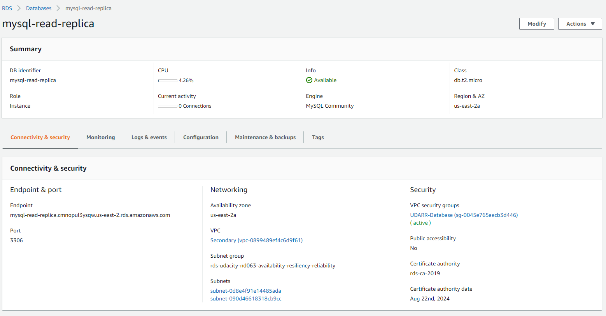

# Udacity Cloud Architect - Project

## Design for Availability, Resiliency and Reliability

### Data durability and recovery

* Active Region: Paris (eu-west-3)
* Standby Region: Ohio (us-east-2)

Outputs of the stack creation for the **Primary VPC**:

**ApplicationSecurityGroup**|**sg-01dcbc0589a15503e**|**ID of the EC2 instance security group**
:-----:|:-----:|:-----:
DatabaseSecurityGroup|sg-0434fdec114051fd6|ID of the database security group
PrivateSubnets|subnet-025fed93e2e4cf44e, subnet-0b05fb0dac7719469|A list of the private subnets
PublicSubnets|subnet-0d9626197800db42e, subnet-0e94d44b7612d02e2|A list of the public subnets
VPC|vpc-0fe80a63a9d688b12|VPC ID

Outputs of the stack creation for the **Secondary Stack**:

**ApplicationSecurityGroup**|**sg-08b7fa85456b6efd1**|**ID of the EC2 instance security group**
:-----:|:-----:|:-----:
DatabaseSecurityGroup|sg-0045e765aecb3d446|ID of the database security group
PrivateSubnets|subnet-0d8e4f91e14485ada, subnet-090d46618318cb9cc|A list of the private subnets
PublicSubnets|subnet-00c56b261abb28884, subnet-0a9712bf66b6f6dff|A list of the public subnets
VPC|vpc-0899489ef4c6d9f61|VPC ID




### Highly durable RDS Database

#### RDS



#### Subnet Groups



#### Private Subnets Route Tables


### Estimate availability of this configuration

**TODO**

### Demonstrate normal usage

```bash
[ec2-user@ip-10-1-10-92 ~]$ mysql -h mysql-primary.ckktpvote178.eu-west-3.rds.amazonaws.com -D udacity -u admin -p
Enter password:
Welcome to the MariaDB monitor.  Commands end with ; or \g.
Your MySQL connection id is 15
Server version: 5.7.22-log Source distribution

Copyright (c) 2000, 2018, Oracle, MariaDB Corporation Ab and others.

Type 'help;' or '\h' for help. Type '\c' to clear the current input statement.

MySQL [udacity]> CREATE TABLE IF NOT EXISTS orders (
    ->     order_id INT AUTO_INCREMENT PRIMARY KEY,
    ->     title VARCHAR(255) NOT NULL,
    ->     status TINYINT NOT NULL,
    ->     priority TINYINT NOT NULL,
    ->     description TEXT,
    ->     created_at TIMESTAMP DEFAULT CURRENT_TIMESTAMP
    -> )  ENGINE=INNODB;
Query OK, 0 rows affected (0.06 sec)

MySQL [udacity]> INSERT INTO `orders`(`title`,`status`,`priority`,`description`)
    ->     VALUES ('Resiliency, Reliability and Availability',1,1,'Learning about AWS');
Query OK, 1 row affected (0.00 sec)

MySQL [udacity]> SELECT * FROM orders;
+----------+------------------------------------------+--------+----------+--------------------+---------------------+
| order_id | title                                    | status | priority | description        | created_at          |
+----------+------------------------------------------+--------+----------+--------------------+---------------------+
|        1 | Resiliency, Reliability and Availability |      1 |        1 | Learning about AWS | 2020-04-16 17:39:24 |
+----------+------------------------------------------+--------+----------+--------------------+---------------------+
1 row in set (0.00 sec)
```





```
MySQL [udacity]> INSERT INTO `orders`(`title`,`status`,`priority`,`description`)
    ->     VALUES ('Resiliency, Reliability and Availability',1,1,'Learning about AWS');
ERROR 1290 (HY000): The MySQL server is running with the --read-only option so it cannot execute this statement
MySQL [udacity]> SELECT * FROM orders;
+----------+------------------------------------------+--------+----------+--------------------+---------------------+
| order_id | title                                    | status | priority | description        | created_at          |
+----------+------------------------------------------+--------+----------+--------------------+---------------------+
|        1 | Resiliency, Reliability and Availability |      1 |        1 | Learning about AWS | 2020-04-16 17:39:24 |
+----------+------------------------------------------+--------+----------+--------------------+---------------------+
1 row in set (0.00 sec)
```

After promotion...

```
MySQL [udacity]> INSERT INTO `orders`(`title`,`status`,`priority`,`description`)
    ->     VALUES ('Resiliency, Reliability and Availability',1,1,'Learning about AWS');
Query OK, 1 row affected (0.00 sec)

MySQL [udacity]> SELECT * FROM orders;
+----------+------------------------------------------+--------+----------+--------------------+---------------------+
| order_id | title                                    | status | priority | description        | created_at          |
+----------+------------------------------------------+--------+----------+--------------------+---------------------+
|        1 | Resiliency, Reliability and Availability |      1 |        1 | Learning about AWS | 2020-04-16 17:39:24 |
|        2 | Resiliency, Reliability and Availability |      1 |        1 | Learning about AWS | 2020-04-16 18:11:57 |
+----------+------------------------------------------+--------+----------+--------------------+---------------------+
2 rows in set (0.00 sec)

```


