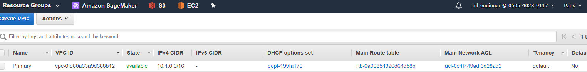
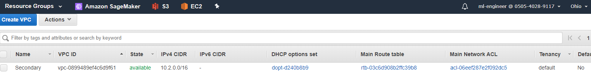
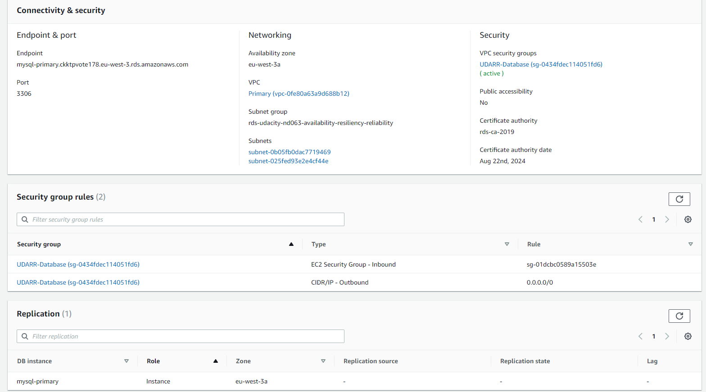
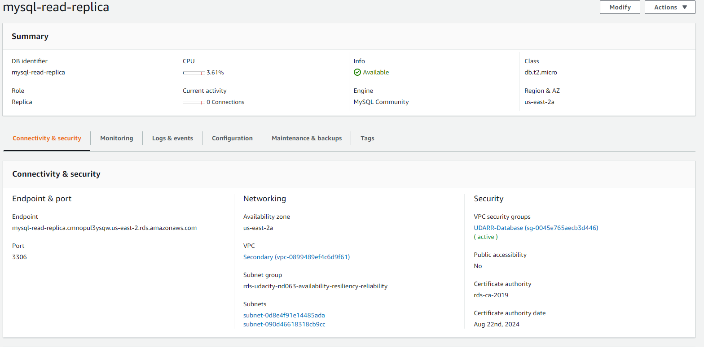
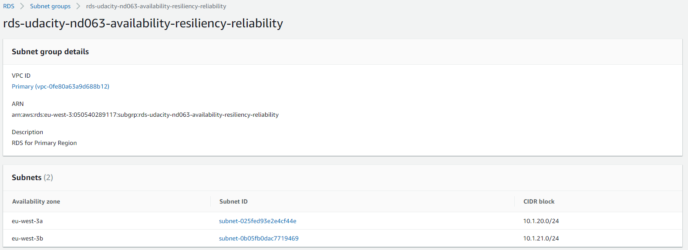
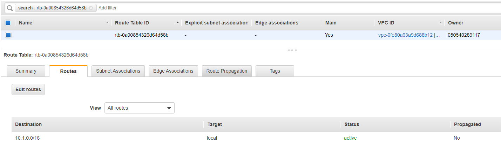
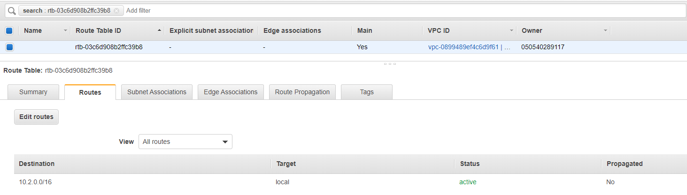
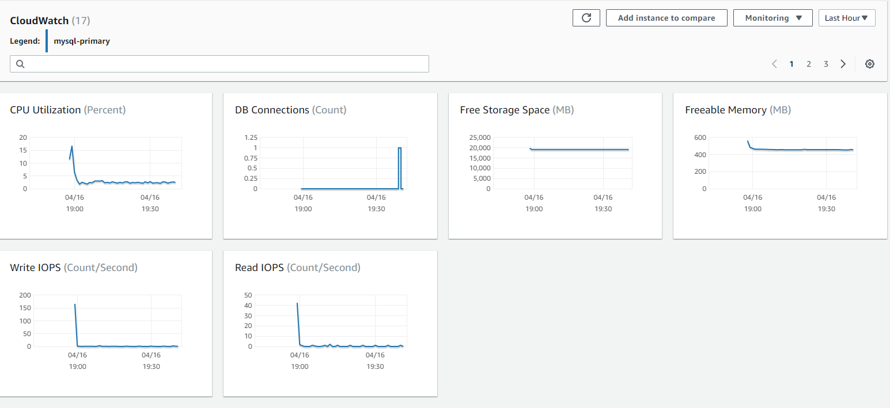
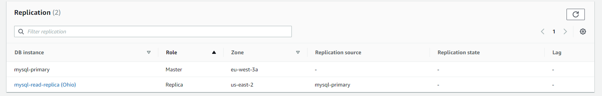

# Udacity Cloud Architect - Project

## Design for Availability, Resiliency and Reliability

### Data durability and recovery

* Active Region: Paris (eu-west-3)
* Standby Region: Ohio (us-east-2)

Outputs of the stack creation for the **Primary VPC**:

**ApplicationSecurityGroup**|**sg-01dcbc0589a15503e**|**ID of the EC2 instance security group**
:-----:|:-----:|:-----:
DatabaseSecurityGroup|sg-0434fdec114051fd6|ID of the database security group
PrivateSubnets|subnet-025fed93e2e4cf44e, subnet-0b05fb0dac7719469|A list of the private subnets
PublicSubnets|subnet-0d9626197800db42e, subnet-0e94d44b7612d02e2|A list of the public subnets
VPC|vpc-0fe80a63a9d688b12|VPC ID

Outputs of the stack creation for the **Secondary Stack**:

**ApplicationSecurityGroup**|**sg-08b7fa85456b6efd1**|**ID of the EC2 instance security group**
:-----:|:-----:|:-----:
DatabaseSecurityGroup|sg-0045e765aecb3d446|ID of the database security group
PrivateSubnets|subnet-0d8e4f91e14485ada, subnet-090d46618318cb9cc|A list of the private subnets
PublicSubnets|subnet-00c56b261abb28884, subnet-0a9712bf66b6f6dff|A list of the public subnets
VPC|vpc-0899489ef4c6d9f61|VPC ID

Image of Primary VPC


Image of Secondary VPC


### Highly durable RDS Database

#### RDS

Primary DB


Replica DB


#### Subnet Groups

Primary RDS Subnet Group


Secondart RDS Subnet Group


#### Private Subnets Route Tables

Primary Private Subnets RT


Secondary Private Subnets RT


### Estimate availability of this configuration

The Recovery Time Objective (RTO) is the maximum time your platform or service can be unavailable.

If there is a single AZ outage, as our RDS is configured using two subnet groups, where each subnet lies on a different AZ within the same region (for both active and standby regions), then we can continue to operate on the AZ which is still up. If the whole region collapses, then our minimum RTO would be the time that it takes for the replica in the standby region to be promoted. If we do not need to insert data, we could still have 0 RTO time and keep reading from the standby region.

The Recovery Point Objective (RPO) is the maximum amount of time that your system can lose data.

Again, for a single AZ outage, there is no issue, as we are running on top of two subnet groups distributed in two different AZs. However, the RPO here would be the time that it takes for the database replica lying in the standby region to be promoted and operative. Meanwhile, our system won't be able to ingest new data.

### Demonstrate normal usage

Insert data in the master replica:

```bash
[ec2-user@ip-10-1-10-92 ~]$ mysql -h mysql-primary.ckktpvote178.eu-west-3.rds.amazonaws.com -D udacity -u admin -p
Enter password:
Welcome to the MariaDB monitor.  Commands end with ; or \g.
Your MySQL connection id is 15
Server version: 5.7.22-log Source distribution

Copyright (c) 2000, 2018, Oracle, MariaDB Corporation Ab and others.

Type 'help;' or '\h' for help. Type '\c' to clear the current input statement.

MySQL [udacity]> CREATE TABLE IF NOT EXISTS orders (
    ->     order_id INT AUTO_INCREMENT PRIMARY KEY,
    ->     title VARCHAR(255) NOT NULL,
    ->     status TINYINT NOT NULL,
    ->     priority TINYINT NOT NULL,
    ->     description TEXT,
    ->     created_at TIMESTAMP DEFAULT CURRENT_TIMESTAMP
    -> )  ENGINE=INNODB;
Query OK, 0 rows affected (0.06 sec)

MySQL [udacity]> INSERT INTO `orders`(`title`,`status`,`priority`,`description`)
    ->     VALUES ('Resiliency, Reliability and Availability',1,1,'Learning about AWS');
Query OK, 1 row affected (0.00 sec)

MySQL [udacity]> SELECT * FROM orders;
+----------+------------------------------------------+--------+----------+--------------------+---------------------+
| order_id | title                                    | status | priority | description        | created_at          |
+----------+------------------------------------------+--------+----------+--------------------+---------------------+
|        1 | Resiliency, Reliability and Availability |      1 |        1 | Learning about AWS | 2020-04-16 17:39:24 |
+----------+------------------------------------------+--------+----------+--------------------+---------------------+
1 row in set (0.00 sec)
```

Master replica configuration


Master replica monitoring and replication



Trying to insert data in the read replica
```
MySQL [udacity]> INSERT INTO `orders`(`title`,`status`,`priority`,`description`)
    ->     VALUES ('Resiliency, Reliability and Availability',1,1,'Learning about AWS');
ERROR 1290 (HY000): The MySQL server is running with the --read-only option so it cannot execute this statement
MySQL [udacity]> SELECT * FROM orders;
+----------+------------------------------------------+--------+----------+--------------------+---------------------+
| order_id | title                                    | status | priority | description        | created_at          |
+----------+------------------------------------------+--------+----------+--------------------+---------------------+
|        1 | Resiliency, Reliability and Availability |      1 |        1 | Learning about AWS | 2020-04-16 17:39:24 |
+----------+------------------------------------------+--------+----------+--------------------+---------------------+
1 row in set (0.00 sec)
```

After promotion, insert works as expected

```
MySQL [udacity]> INSERT INTO `orders`(`title`,`status`,`priority`,`description`)
    ->     VALUES ('Resiliency, Reliability and Availability',1,1,'Learning about AWS');
Query OK, 1 row affected (0.00 sec)

MySQL [udacity]> SELECT * FROM orders;
+----------+------------------------------------------+--------+----------+--------------------+---------------------+
| order_id | title                                    | status | priority | description        | created_at          |
+----------+------------------------------------------+--------+----------+--------------------+---------------------+
|        1 | Resiliency, Reliability and Availability |      1 |        1 | Learning about AWS | 2020-04-16 17:39:24 |
|        2 | Resiliency, Reliability and Availability |      1 |        1 | Learning about AWS | 2020-04-16 18:11:57 |
+----------+------------------------------------------+--------+----------+--------------------+---------------------+
2 rows in set (0.00 sec)
```

Configuration after read replica promotion


### Website recovery

1. To recover an old version, we could just delete the new version, making the old one the current.
2. Deleting an object in version enabled buckets created a deletion marker on the object as a new version.
3. To recover the "deleted" object, we can delete the version with the deletion marker.

Images for the website:

1. s3_original.png
2. s3_season.png
3. s3_season_revert.png
4. s3_deletion.png
5. s3_deletion_marker.png
6. s3_delete_revert.png
